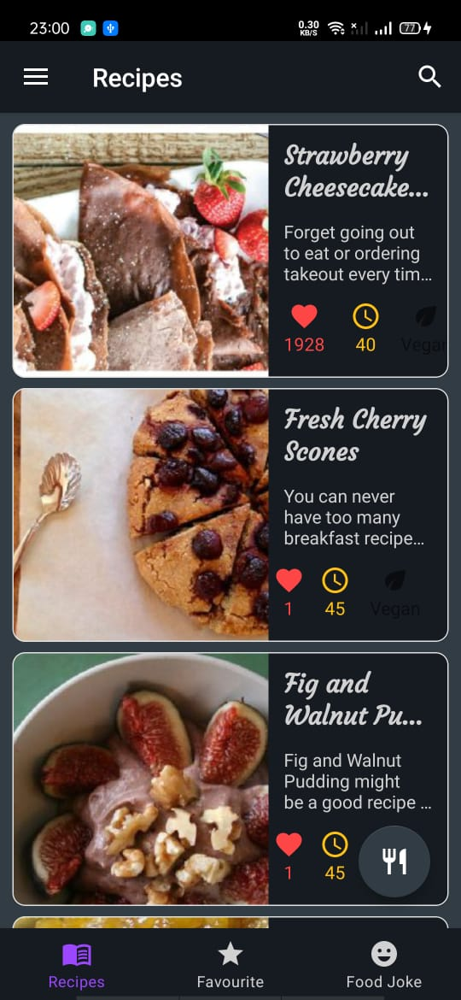
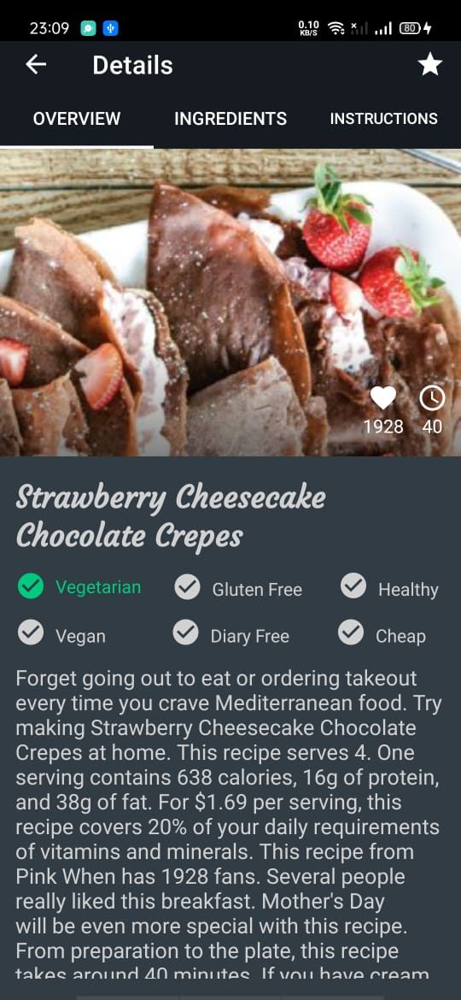
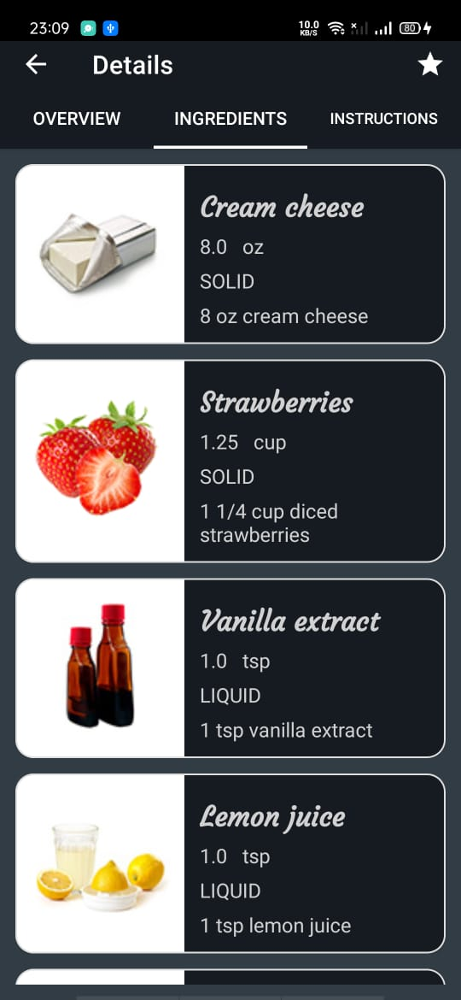
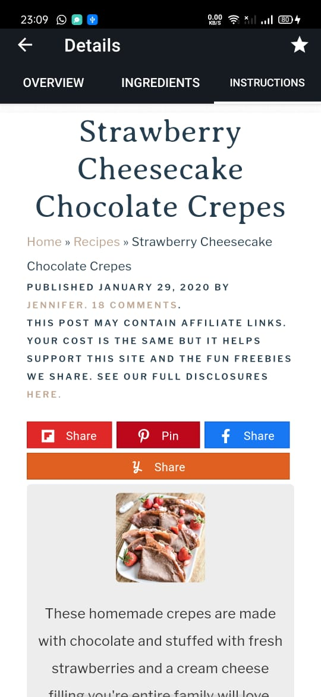
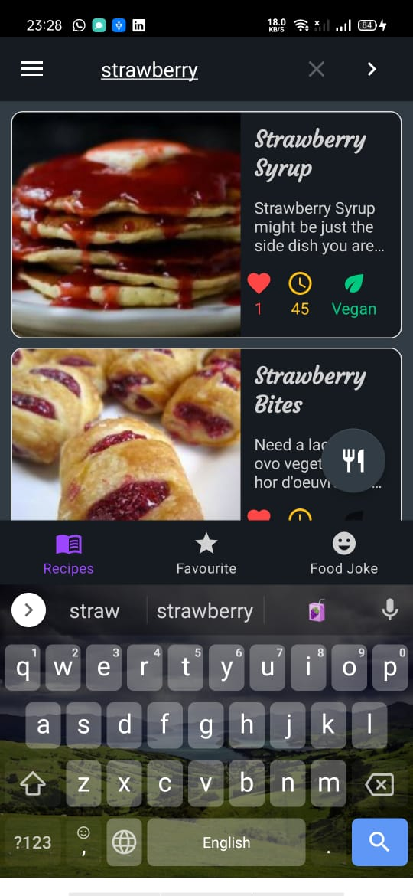
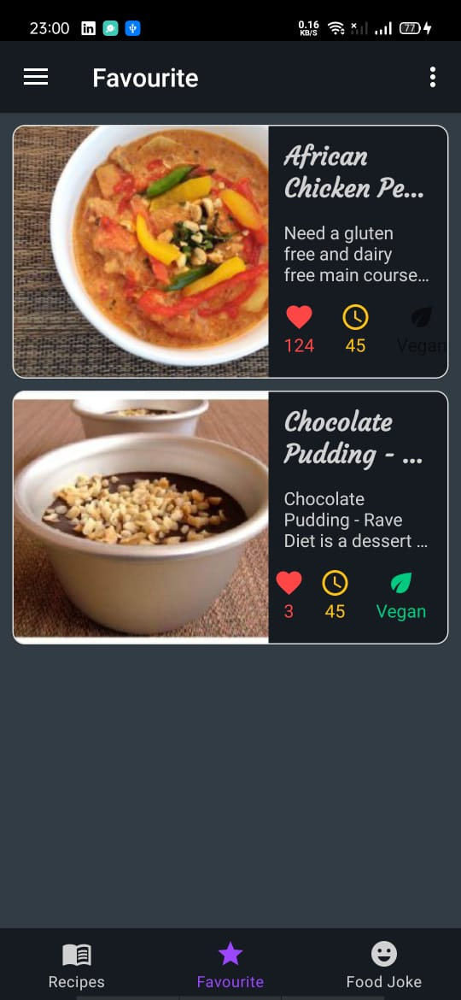
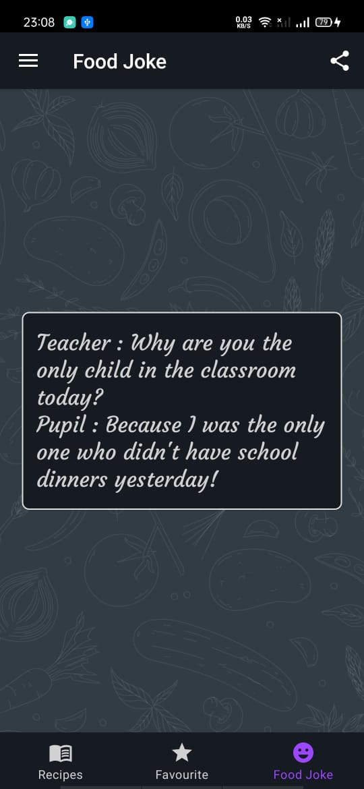
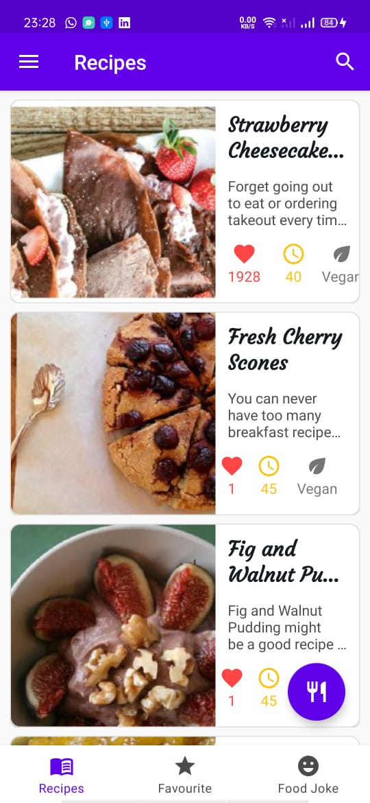
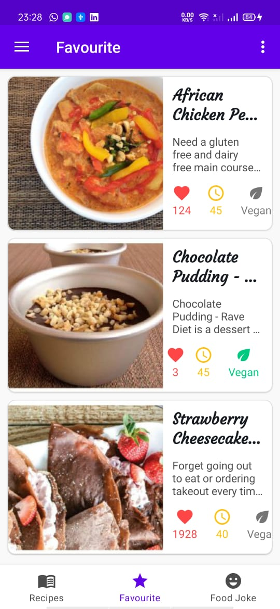
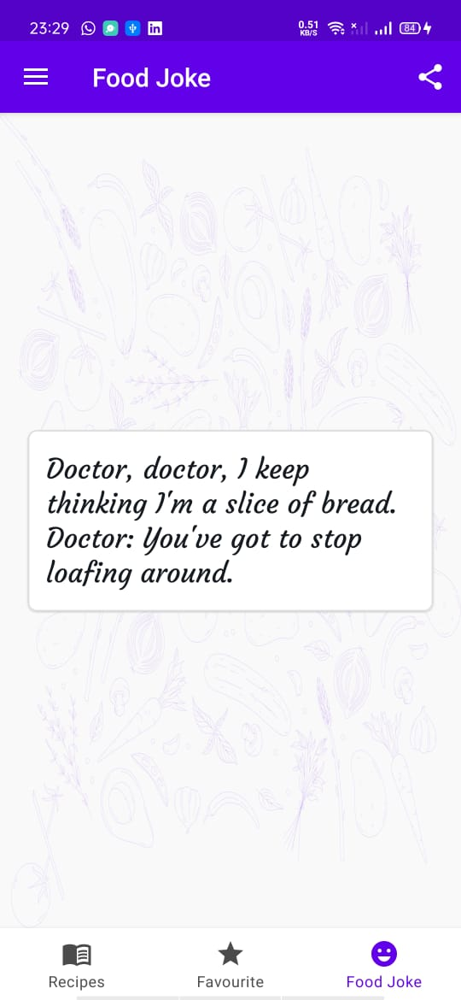

# Foody - Food Recipe App

# Objective:
- Food Recipes application, where we can browse recipes from various different kind of meal and diet types.
The app will work with both Remote and local data sources. And for Remote data source I used a third party API for food recipes,
called Spoonacular. So basically I will send GET Request to the API and receive a list of food recipes as a Response. 

- Also the app will be able to handle no internet connection, and store or cache the data localy to our ROOM database when it's needed.
Also from the app we will be able to search recipes from our API directly. So if you have your favorite flavor you can search it here 
and probably you'll find many amazing recipes, our app will have Favorites Fragment where we can save our favorite recipes for later use when we need them. 

- And finally our app will have it's fun side, and that is food joke fragment.

# Built With:
• Kotlin  
• ROOM Database  
• Dependency Injection - Dagger-Hilt  
• Retrofit  
• Offline Cache  
• Kotlin Coroutines  
• MVVM Architecture  
• Navigation Component  
• DataStore Preferences  
• Data Binding  
• Binding Adpaters  
• LiveData  
• Flow  
• Motion Layout  
• Recycler View + DiffUtil 
• Shimmer Effect  
• ViewPager2  
• Client - Server Communication  
• Contextual Action Mode  
• Material Components  
• Material Design  

# Screen Shots:

